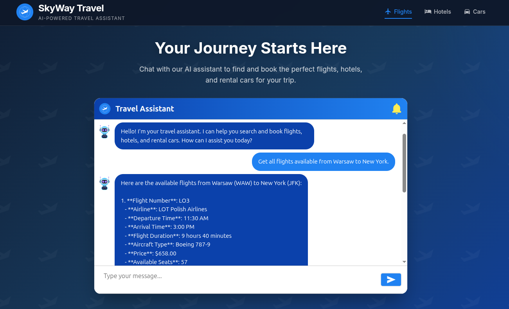

# 📦 Spring AI Travel Agent


## 📝 Overview

This repository contains a full-stack AI-powered travel booking assistant built with **Spring AI** and the **Model
Context Protocol (MCP)**. This project demonstrates how to build a conversational agent that can search,
compare, and book flights, hotels, and rental cars through natural language interactions.

The system showcases a microservices architecture where each travel domain (flights, hotels, cars) is implemented as an
independent service, with **MCP servers** exposing their functionality as **AI-callable tools**. The central agent
orchestrates these tools using AWS Bedrock (Amazon Nova) to provide a seamless booking experience.



### Key Features

- **Conversational Booking** — Natural language interface for searching and booking travel services
- **Multi-Domain Support** — Integrated flights, hotels, and car rental booking capabilities
- **MCP Integration** — Tool-based AI architecture using Spring AI's MCP implementation
- **Microservices Architecture** — Loosely coupled services with clean API contracts
- **Modern React UI** — travel-themed chat interface built with react-chatbotify

## 🛠️ Tech Stack

| Layer    | Technology                                     |
|----------|------------------------------------------------|
| AI/LLM   | Spring AI 1.1.2                                |
| Backend  | Java 21, Spring Boot 3.5.9, Spring AI MCP      |
| Frontend | React 19, TypeScript, react-chatbotify         |
| Protocol | Model Context Protocol (MCP) - Streamable HTTP |
| Build    | Maven (multi-module), npm                      |

## 🏗️ Architecture

```
┌─────────────────┐     ┌─────────────────┐     ┌─────────────────┐
│  agent-chat-ui  │────▶│      agent      │────▶│   AWS Bedrock   │
│   (React UI)    │     │  (Spring AI)    │     │  (Amazon Nova)  │
└─────────────────┘     └────────┬────────┘     └─────────────────┘
                                 │
                    ┌────────────┼────────────┐
                    ▼            ▼            ▼
            ┌──────────┐  ┌──────────┐  ┌──────────┐
            │  Cars    │  │ Flights  │  │  Hotels  │
            │   MCP    │  │   MCP    │  │   MCP    │
            │  Server  │  │  Server  │  │  Server  │
            └────┬─────┘  └────┬─────┘  └────┬─────┘
                 │             │             │
                 ▼             ▼             ▼
            ┌──────────┐  ┌──────────┐  ┌──────────┐
            │  Cars    │  │ Flights  │  │  Hotels  │
            │ Service  │  │ Service  │  │ Service  │
            └──────────┘  └──────────┘  └──────────┘
```

### Component Ports

| Component            | Port | Description         |
|----------------------|------|---------------------|
| agent-chat-ui        | 3000 | React frontend      |
| agent                | 8050 | Central AI agent    |
| cars-microservice    | 8010 | Car rental REST API |
| cars-mcp-server      | 8011 | Car tools for AI    |
| flights-microservice | 8020 | Flights REST API    |
| flights-mcp-server   | 8021 | Flight tools for AI |
| hotels-microservice  | 8030 | Hotels REST API     |
| hotels-mcp-server    | 8031 | Hotel tools for AI  |

### Data Storage

For simplicity, **all data is kept in-memory only** — no real database is used. Each microservice maintains its own
in-memory data store with pre-populated sample data (flights, hotels, car rental locations, etc.). Data is reset when
services restart.

### MCP Server to Microservice Communication

Each MCP Server connects to its corresponding Microservice via REST API using Spring's **declarative HTTP Service
Client** (`HttpServiceProxyFactory`). The API contracts are defined as interfaces with `@HttpExchange` annotations in
the `*-microserivce-api` modules, which are shared between the microservice (server) and the client.

```
┌─────────────────┐      ┌─────────────────┐      ┌─────────────────┐
│   MCP Server    │─────▶│  Client Module  │─────▶│  Microservice   │
│ (exposes tools) │      │ (HTTP Service)  │      │   (REST API)    │
└─────────────────┘      └─────────────────┘      └─────────────────┘
        │                        │                        │
   @McpTool             HttpServiceProxyFactory     @RestController
   annotations          + RestClientAdapter         + @HttpExchange
```

## 🔧 MCP Tools

The AI agent has access to the following tools exposed by MCP servers:

### ✈️ Flights MCP Tools

| Tool                     | Description                                                                        |
|--------------------------|------------------------------------------------------------------------------------|
| `getAllAvailableFlights` | Get all available flights, optionally filtered by departure and/or arrival airport |
| `getFlightByNumber`      | Get a flight by its flight number                                                  |
| `getAllFlightsBookings`  | Get all flight bookings                                                            |
| `getFlightBooking`       | Get a flight booking by its reference number                                       |
| `createFlightBooking`    | Create a new flight booking with passengers and flight numbers                     |
| `updateFlightBooking`    | Update an existing flight booking                                                  |
| `cancelFlightBooking`    | Cancel an existing flight booking                                                  |

### 🏨 Hotels MCP Tools

| Tool                                 | Description                                                  |
|--------------------------------------|--------------------------------------------------------------|
| `getAllAvailableHotels`              | Get all available hotels                                     |
| `getHotelById`                       | Get a hotel by its ID                                        |
| `getRoomsByHotelId`                  | Get all rooms available at a specific hotel                  |
| `searchForAvailableRooms`            | Search for available hotel rooms by airport code and/or city |
| `getAllHotelsBookingsByHotelId`      | Get all hotel bookings, optionally filtered by hotel         |
| `getHotelBookingsByBookingReference` | Get a hotel booking by its reference number                  |
| `createHotelBooking`                 | Create a new hotel booking with guests and room details      |
| `updateHotelBooking`                 | Update an existing hotel booking                             |
| `cancelHotelBooking`                 | Cancel an existing hotel booking                             |

### 🚗 Cars MCP Tools

| Tool                            | Description                                                  |
|---------------------------------|--------------------------------------------------------------|
| `getAllCarRentalLocations`      | Get all locations where cars for rental are available        |
| `getCarRentalLocationById`      | Get location of car rental service by its ID                 |
| `getCarsByCarRentalLocationId`  | Get all cars available for rental at a given location        |
| `getAllCarsAvailableForRent`    | Get all cars available for rental in all locations           |
| `getCarAvailableForRentById`    | Get car by its ID                                            |
| `searchForAvailableCarsForRent` | Search for available cars by airport code and/or city        |
| `getAllCarRentalBookings`       | Get all car rental bookings, optionally filtered by location |
| `getCarRentalBooking`           | Get a car rental booking by its reference number             |
| `createCarRentalBooking`        | Create a new car rental booking with drivers and dates       |
| `updateCarRentalBooking`        | Update an existing car rental booking                        |
| `cancelCarRentalBooking`        | Cancel an existing car rental booking                        |

## 🚀 Usage

### Prerequisites

- Java 21+
- Maven 3.9+
- Node.js 18+
- AWS account with Bedrock access (Amazon Nova model enabled)
- AWS credentials configured (`~/.aws/credentials` or environment variables)

### Running Locally

1. **Build the project**
   ```bash
   mvn clean install
   ```

2. **Start all backend services** (from project root, in separate terminals or use IDE run configurations)
   ```bash
   # Microservices
   cd cars/cars-microserivce && mvn spring-boot:run
   cd flights/flights-microserivce && mvn spring-boot:run
   cd hotels/hotels-microserivce && mvn spring-boot:run

   # MCP Servers
   cd cars/cars-mcp-server && mvn spring-boot:run
   cd flights/flights-mcp-server && mvn spring-boot:run
   cd hotels/hotels-mcp-server && mvn spring-boot:run

   # Agent
   cd agent && mvn spring-boot:run
   ```

3. **Start the frontend**
   ```bash
   cd agent-chat-ui
   npm install
   npm start
   ```

4. **Open the application** at http://localhost:3000

## ✍ Author

Dominik Cebula

- https://dominikcebula.com/
- https://blog.dominikcebula.com/
- https://www.udemy.com/user/dominik-cebula/
