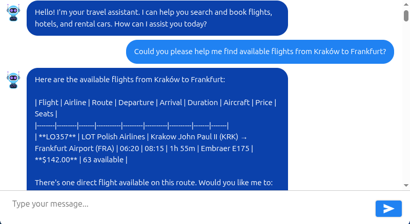
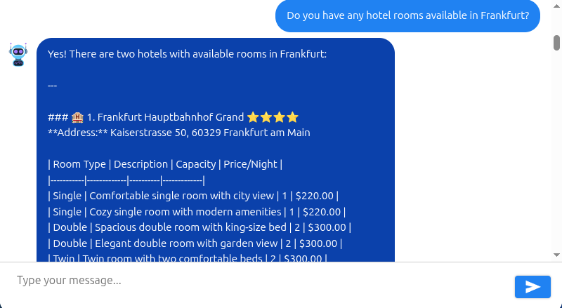
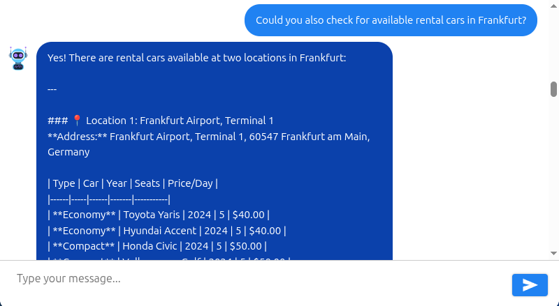
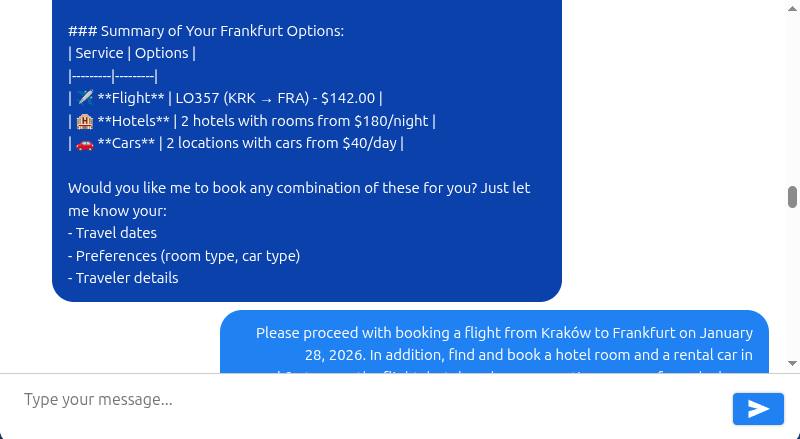
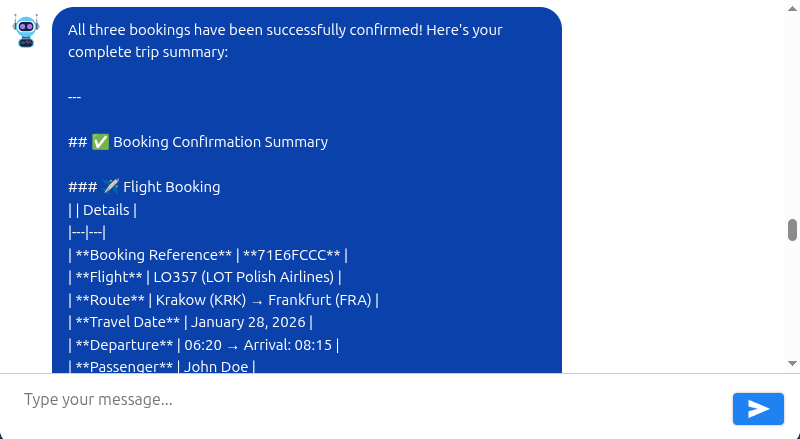
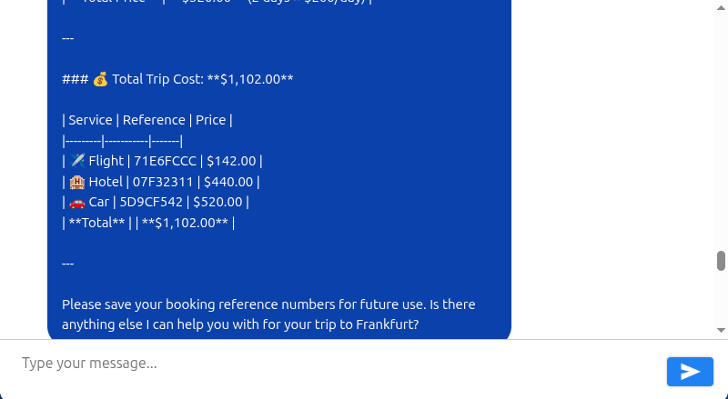
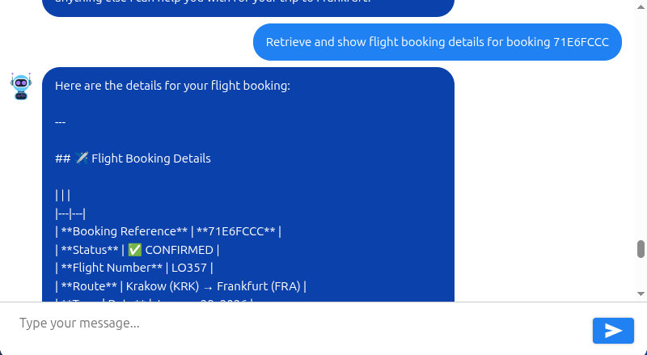
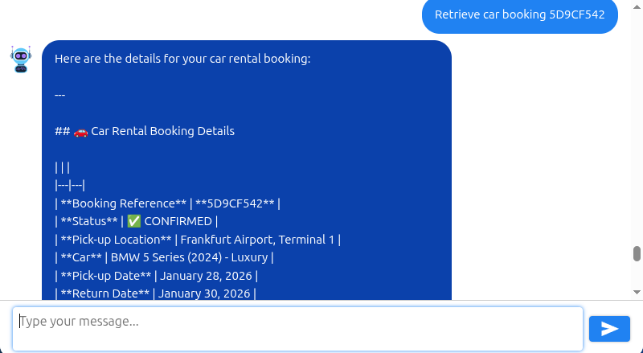

# AI Travel Agent using Spring AI


## Introduction

In this article, I will describe how I built a simplified AI-powered travel agent using Spring AI.

The end result is a conversational travel assistant that helps users search for and book flights, hotels, and rental
cars through natural language interactions.

The agent is accessible through a web-based chat interface built with React. It looks like this:


The full source code is available on GitHub:

https://github.com/dominikcebula/spring-ai-travel-agent

## Demo

Below are screenshots showing the agent in action while booking a trip from Kraków to Frankfurt:

















## Architecture

The diagram below illustrates the overall architecture of the solution.


The project is divided into three domains:

- Flights
- Hotels
- Rental Cars

Each domain consists of an MCP Server, a set of MCP Tools, a REST API, and a Microservice that implements the API.

Within each domain, it is possible to perform search operations and manage bookings either via a REST API or through the
MCP protocol, which is well suited for AI agent integrations.

## Notes on the Solution Design

There are multiple ways this problem could be decomposed and implemented.

Instead of deploying a dedicated MCP Server per domain, the MCP Servers could be combined into a single Microservice
exposing both REST APIs and the MCP protocol.

Another option would be to implement MCP Tools directly on the agent side, allowing the agent to call Microservices via
REST without an intermediate MCP Server layer.

Alternatively, the entire solution could be implemented as a modular monolith using Spring Modulith, with each domain
represented as a separate module.

Different approaches may be preferable depending on project requirements, team preferences, and operational constraints.

The current approach prioritizes decoupling, independent deployments, and fine-grained scalability, at the cost of
increased complexity, network overhead, and latency.

## Tech Stack

The following technologies are used in this solution:

| Layer    | Technology                                     |
|----------|------------------------------------------------|
| AI / LLM | Spring AI 1.1.2                                |
| Backend  | Java 21, Spring Boot 3.5.9, Spring AI MCP      |
| Frontend | React 19, TypeScript, react-chatbotify         |
| Protocol | Model Context Protocol (MCP) - Streamable HTTP |
| Build    | Maven (multi-module), npm                      |

## Implementation

### Agent

The agent is built using Spring AI and uses the Claude Opus 4.5 model hosted on Amazon Bedrock.

It accesses MCP tools for flights, hotels, and rental cars via an MCP client. For each domain, an MCP server
communicates with a backing microservice over a REST API to execute the business logic for search and booking
operations.

The agent uses an in-memory chat history to retain context across conversations with the user.

To constrain the agent’s interactions to those of a “helpful travel assistant” that supports booking flights, hotels,
and rental cars, a system prompt is used to guide and control the agent’s behavior.

The agent code looks like this:

```java

@RestController
@RequestMapping("/api/v1")
public class AgentController {
    private final ChatClient chatClient;

    public AgentController(ChatClient.Builder chatClientBuilder, ToolCallbackProvider toolCallbackProvider, ChatMemory chatMemory) {
        this.chatClient = chatClientBuilder
                .defaultToolCallbacks(toolCallbackProvider)
                .defaultAdvisors(MessageChatMemoryAdvisor.builder(chatMemory).build())
                .defaultSystem(
                        """
                                You are a helpful travel assistant who can help with booking flights, hotels, and rental cars.
                                Your primary responsibility is to help users search for, compare, and book flights, hotels, and rental cars efficiently and accurately.
                                
                                Use provided Flight Booking Tools, Hotels Booking Tools, and Cars Rental Tools to assist the user with their travel needs.
                                Always use the tools available to get information and perform actions on behalf of the user.
                                
                                Be professional, concise, and friendly.
                                Use clear, structured responses that are easy to scan.
                                Avoid unnecessary verbosity while ensuring all critical booking information is communicated.
                                Your goal is to act as a reliable, tool-driven travel booking assistant that helps users complete their travel arrangements with confidence and clarity.
                                
                                If the user asks for information that is not related to travel bookings, respond politely that you can only assist with travel bookings.
                                """)
                .build();
    }

    @GetMapping("/agent")
    public String generation(String userInput) {
        return chatClient.prompt()
                .user(userInput)
                .call()
                .content();
    }
}

```

The agent accesses MCP tools using an MCP client configured in `application.yml`:

```yaml
spring:
  ai:
    bedrock:
      aws:
        region: eu-central-1
      converse:
        chat:
          options:
            model: eu.anthropic.claude-opus-4-5-20251101-v1:0
            max-tokens: 4096
    mcp:
      client:
        streamable-http:
          connections:
            cars-mcp-server:
              url: ${CARS_MCP_URL:http://localhost:8011}
            flights-mcp-server:
              url: ${FLIGHTS_MCP_URL:http://localhost:8021}
            hotels-mcp-server:
              url: ${HOTELS_MCP_URL:http://localhost:8031}
server:
  port: 8050
```

The agent can be used without a web UI by sending requests to the `/api/v1/agent` endpoint with user input. For example:

```bash
$ curl http://localhost:8050/api/v1/agent?userInput=Show%20me%20all%20Hotels%20available%20at%20Krakow
Here are the hotels available in Krakow with rooms available:

1. **Krakow Main Square Hotel**
   - Address: Rynek Glowny 28, 31-010 Krakow
   - Star Rating: 5
   - Available Rooms:
     - Comfortable single room with city view
     - Cozy single room with modern amenities
     - Spacious double room with king-size bed
     - Elegant double room with garden view
     - Twin room with two comfortable beds
     - Deluxe room with premium furnishings and minibar
     - Family room with space for up to 4 guests
     - Luxury suite with separate living area and premium amenities

2. **Kazimierz Historic Inn**
   - Address: Szeroka 18, 31-053 Krakow
   - Star Rating: 4
   - Available Rooms:
     - Comfortable single room with city view
     - Cozy single room with modern amenities
     - Spacious double room with king-size bed
     - Elegant double room with garden view
     - Twin room with two comfortable beds
     - Deluxe room with premium furnishings and minibar
     - Family room with space for up to 4 guests
     - Luxury suite with separate living area and premium amenities

...
```

The full source code for the agent is available on
GitHub: https://github.com/dominikcebula/spring-ai-travel-agent/tree/main/agent

### Agent Chat Web UI

The agent’s chat web UI is built with ReactJS and [react-chatbotify](https://react-chatbotify.com/). It communicates
with the agent via the `/api/v1/agent` endpoint.

The chatbot UI source code looks like this:

```typescript jsx
    <ChatBot flow={flow}
             settings={{
                 general: {
                     embedded: true,
                     primaryColor: "#3b82f6",
                     secondaryColor: "#1e40af"
                 },
                 header: {
                     title: "Travel Assistant",
                     avatar: "/travel-agent-icon.svg"
                 },
                 chatHistory: {
                     storageKey: "travel_agent_chat"
                 },
                 chatWindow: {
                     showScrollbar: true
                 },
                 botBubble: {
                     showAvatar: true
                 }
             }}/>
```

The code that calls the agent API is shown below:

```typescript jsx
async function callAgent(userInput: string): Promise<string> {
    const response = await fetch(
        `${API_BASE_URL}/api/v1/agent?userInput=${encodeURIComponent(userInput)}`
    );
    if (!response.ok) {
        throw new Error(`API error: ${response.status}`);
    }
    return response.text();
}

const flow: Flow = {
    start: {
        message: "Hello! I'm your travel assistant. I can help you search and book flights, hotels, and rental cars. How can I assist you today?",
        path: "chat"
    },
    chat: {
        message: async (params: Params) => {
            try {
                return await callAgent(params.userInput);
            } catch (error) {
                return "Sorry, I'm having trouble connecting to the server. Please try again later.";
            }
        },
        path: "chat"
    }
};
```

The end result allows the user to interact with the agent like this:


The full source code is available on
GitHub: https://github.com/dominikcebula/spring-ai-travel-agent/tree/main/agent-chat-ui

### MCP Servers and MCP Tools

MCP servers host MCP tools for each domain, allowing the agent to access and manage booking data.

Each MCP server acts as a wrapper around a backing microservice, which handles the business logic for search and booking
operations within its domain.

Here is an example of MCP tools for flight search:

```java

@Component
public class FlightsTools {
    private final FlightsApi flightsApi;

    public FlightsTools(FlightsApi flightsApi) {
        this.flightsApi = flightsApi;
    }

    @McpTool(description = "Get all available flights, optionally filtered by departure and/or arrival airport")
    public List<Flight> getAllAvailableFlights(
            @McpToolParam(required = false, description = "Departure airport code")
            String departure,
            @McpToolParam(required = false, description = "Arrival airport code")
            String arrival) {
        return flightsApi.getAllFlights(departure, arrival);
    }

    @McpTool(description = "Get a flight by its flight number")
    public Flight getFlightByNumber(
            @McpToolParam(description = "Flight number")
            String flightNumber) {
        return flightsApi.getFlightByNumber(flightNumber);
    }
}
```

Here is an example of MCP tools for flight booking:

```java

@Component
public class BookingsTools {
    private final BookingsApi bookingsApi;

    public BookingsTools(BookingsApi bookingsApi) {
        this.bookingsApi = bookingsApi;
    }

    @McpTool(description = "Get all flight bookings")
    public List<Booking> getAllFlightsBookings() {
        return bookingsApi.getAllBookings();
    }

    @McpTool(description = "Get a flight booking by its reference number")
    public Booking getFlightBooking(
            @McpToolParam(description = "Booking reference number")
            String bookingReference) {
        return bookingsApi.getBooking(bookingReference);
    }

    @McpTool(description = "Create a new flight booking")
    public Booking createFlightBooking(
            @McpToolParam(description = "Booking request containing passengers list (each with firstName, lastName, dateOfBirth, passportNumber, email, phoneNumber), flightNumbers list, and travelDate")
            CreateBookingRequest request) {
        return bookingsApi.createBooking(request);
    }

    @McpTool(description = "Update an existing flight booking")
    public Booking updateFlightBooking(
            @McpToolParam(description = "Booking reference number")
            String bookingReference,
            @McpToolParam(description = "Update request containing passengers list (each with firstName, lastName, dateOfBirth, passportNumber, email, phoneNumber), flightNumbers list, and travelDate")
            UpdateBookingRequest request) {
        return bookingsApi.updateBooking(bookingReference, request);
    }

    @McpTool(description = "Cancel an existing flight booking")
    public Booking cancelFlightBooking(
            @McpToolParam(description = "Booking reference number")
            String bookingReference) {
        return bookingsApi.cancelBooking(bookingReference);
    }
}
```

MCP tools for hotels and rental cars are developed in a similar manner.

The full source code is available on GitHub:

- https://github.com/dominikcebula/spring-ai-travel-agent/tree/main/flights/flights-mcp-server
- https://github.com/dominikcebula/spring-ai-travel-agent/tree/main/cars/cars-mcp-server
- https://github.com/dominikcebula/spring-ai-travel-agent/tree/main/hotels/hotels-mcp-server

### MCP Server to Micoservice Communication

MCP servers communicate with backing microservices via REST APIs.

To avoid duplicating code between MCP servers and
microservices, [Declarative HTTP Service Clients](https://docs.spring.io/spring-framework/reference/integration/rest-clients.html#rest-http-service-client)
are used.


Each microservice exposes a REST API that is also represented as a Java interface, for example:

```java

@HttpExchange("/api/v1/flights")
public interface FlightsApi {

    @GetExchange
    List<Flight> getAllFlights(
            @RequestParam(required = false) String departure,
            @RequestParam(required = false) String arrival);

    @GetExchange("/{flightNumber}")
    Flight getFlightByNumber(@PathVariable String flightNumber);
}
```

The same interface is then used in the controller implementation:

```java

@RestController
public class FlightsController implements FlightsApi {

    // ...

    @Override
    public List<Flight> getAllFlights(String departure, String arrival) {
        // ...
    }

    @Override
    public Flight getFlightByNumber(String flightNumber) {
        // ...
    }
}
```

It is also used for client creation:

```java
public class FlightsClientFactory {
    private FlightsClientFactory() {
    }

    public static BookingsApi newBookingsApiClient(String baseUrl) {
        return createClient(BookingsApi.class, baseUrl);
    }

    public static FlightsApi newFlightsApiClient(String baseUrl) {
        return createClient(FlightsApi.class, baseUrl);
    }

    private static <S> S createClient(Class<S> serviceType, String baseUrl) {
        RestClient restClient = RestClient.create(baseUrl);
        RestClientAdapter adapter = RestClientAdapter.create(restClient);
        HttpServiceProxyFactory factory = HttpServiceProxyFactory.builderFor(adapter).build();
        return factory.createClient(serviceType);
    }
}
```

Each REST API client bean is then created as shown below:

```java

@Configuration
public class FlightsRestApiClientConfiguration {
    @Value("${flights.api.base-uri}")
    private String baseUri;

    @Bean
    public BookingsApi bookingsApi() {
        return FlightsClientFactory.newBookingsApiClient(baseUri);
    }

    @Bean
    public FlightsApi flightsApi() {
        return FlightsClientFactory.newFlightsApiClient(baseUri);
    }
}
```

Downstream microservice URLs are configured in the application properties:

```properties
flights.api.base-uri=${FLIGHTS_API_BASE_URI:http://localhost:8020}
```

By default, these URLs point to the local development environment. During deployment, the `FLIGHTS_API_BASE_URI`
environment variable is set to the actual URL of the microservice.

The full source code is available on GitHub (using the flights example, but the same approach applies to hotels and
rental cars):

- https://github.com/dominikcebula/spring-ai-travel-agent/tree/main/flights/flights-microserivce-api
- https://github.com/dominikcebula/spring-ai-travel-agent/tree/main/flights/flights-microserivce-client
- https://github.com/dominikcebula/spring-ai-travel-agent/blob/main/flights/flights-mcp-server/src/main/java/com/dominikcebula/spring/ai/flights/configuration/FlightsRestApiClientConfiguration.java

### Microservices

Three Microservices are used in this solution:

- Flights Microservice
- Hotels Microservice
- Cars Microservice

Each microservice is developed with Spring Boot and exposes a REST API to handle search and booking operations for its
domain.

For simplicity, each microservice uses in-memory storage to manage booking data.

Each microservice implements its API as a Java interface to avoid code duplication between the REST API service
implementation and the REST API client.

Here is an example of the Flights Booking API declared as a Java interface:

```java

@HttpExchange("/api/v1/bookings")
public interface BookingsApi {

    @GetExchange
    List<Booking> getAllBookings();

    @GetExchange("/{bookingReference}")
    Booking getBooking(@PathVariable String bookingReference);

    @PostExchange
    Booking createBooking(@RequestBody CreateBookingRequest request);

    @PutExchange("/{bookingReference}")
    Booking updateBooking(@PathVariable String bookingReference, @RequestBody UpdateBookingRequest request);

    @DeleteExchange("/{bookingReference}")
    Booking cancelBooking(@PathVariable String bookingReference);
}
```

Here is an example implementation of the Flights Booking REST API service:

```java

@RestController
public class BookingsController implements BookingsApi {

    private final BookingsService bookingsService;

    public BookingsController(BookingsService bookingsService) {
        this.bookingsService = bookingsService;
    }

    @Override
    public List<Booking> getAllBookings() {
        return bookingsService.getAllBookings();
    }

    @Override
    public Booking getBooking(String bookingReference) {
        return bookingsService.getBookingByReference(bookingReference)
                .orElseThrow(() -> new ResourceNotFoundException("Booking not found: " + bookingReference));
    }

    @Override
    @ResponseStatus(HttpStatus.CREATED)
    public Booking createBooking(CreateBookingRequest request) {
        return bookingsService.createBooking(request);
    }

    @Override
    public Booking updateBooking(String bookingReference, UpdateBookingRequest request) {
        return bookingsService.updateBooking(bookingReference, request)
                .orElseThrow(() -> new ResourceNotFoundException("Booking not found: " + bookingReference));
    }

    @Override
    public Booking cancelBooking(String bookingReference) {
        return bookingsService.cancelBooking(bookingReference)
                .orElseThrow(() -> new ResourceNotFoundException("Booking not found: " + bookingReference));
    }
}
```

Most of the business logic is implemented in `Service` classes, while data is stored in in-memory repository classes.

The full source code is available on GitHub:

- https://github.com/dominikcebula/spring-ai-travel-agent/tree/main/flights/flights-microserivce
- https://github.com/dominikcebula/spring-ai-travel-agent/tree/main/cars/cars-microserivce
- https://github.com/dominikcebula/spring-ai-travel-agent/tree/main/hotels/hotels-microserivce

### Running the project Locally

To run the project locally, you will need the following prerequisites:

- Java 21+
- Maven 3.9+
- Node.js 18+
- Docker / Docker Compose
- AWS account with Bedrock access (Claude Opus 4.5 model enabled)
- AWS credentials configured (`~/.aws/credentials` or environment variables)

Once all prerequisites are in place, you can clone the project:

```bash
git clone https://github.com/dominikcebula/spring-ai-travel-agent.git
```

Build the project:

```bash
mvn clean install
```

Run all the services:

```bash
# Microservices
(cd cars/cars-microserivce && mvn spring-boot:run) &
(cd flights/flights-microserivce && mvn spring-boot:run) &
(cd hotels/hotels-microserivce && mvn spring-boot:run) &

# MCP Servers
(cd cars/cars-mcp-server && mvn spring-boot:run) &
(cd flights/flights-mcp-server && mvn spring-boot:run) &
(cd hotels/hotels-mcp-server && mvn spring-boot:run) &

# Agent
(cd agent && mvn spring-boot:run) &
```

Run the agent chat UI:

```bash
cd agent-chat-ui
npm install
npm start
```

Alternatively, you can use the IntelliJ run configurations included in the repository to start all the services and the
agent chat UI.

Once everything is running, open http://localhost:3000/.

You can now interact with the agent to search for flights, hotels, and rental cars, as well as create bookings.

## Further Enhancements

The following enhancements could be implemented in the future:

- Persist conversation history between the user and the agent in a database.
- Ensure conversation isolation between different users.
- Implement agent correctness evaluation.
- Add short-term memory (STM) and long-term memory (LTM) support, including extraction and storage of user preferences.
- Security hardening.
- Store flights, hotels, and rental cars data in a database.
- Perform validation of user input on the microservices side.

## Summary

This article demonstrated how to build an AI-powered travel agent using Spring AI. The solution uses a microservices
architecture with three domains – flights, hotels, and rental cars – each consisting of a REST API microservice, an MCP
server exposing tools to the AI agent.

The central agent, powered by Claude Opus 4.5 running on Amazon Bedrock, connects to MCP servers via streamable HTTP and
uses a system prompt to constrain its behavior to travel-related tasks. A React-based chat UI built with
react-chatbotify provides the user interface for natural language interactions.

The project serves as a practical example of using Spring AI to build conversational AI applications that
can perform real actions through tool calling.

## References

- [Source Code on GitHub](https://github.com/dominikcebula/spring-ai-travel-agent/)
- [Spring AI Documentation](https://docs.spring.io/spring-ai/reference/)
- [Awesome Spring AI](https://github.com/spring-ai-community/awesome-spring-ai)
- [react-chatbotify.com](https://react-chatbotify.com/)
