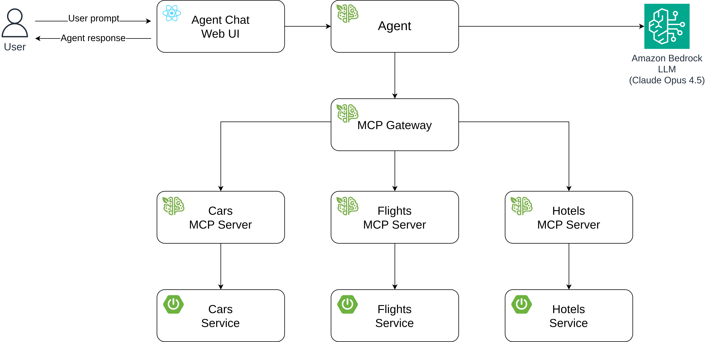
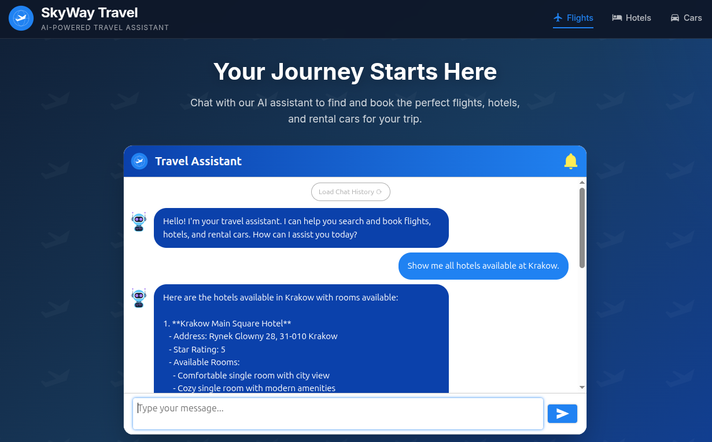
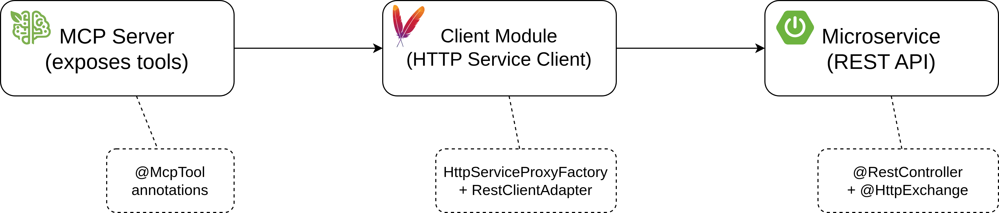

# AI Travel Agent using Spring AI


## Introduction

In this article, I'll describe how I created a simplified travel agent using Spring AI.

The end result is an AI-powered travel agent that can help you search, and book flights, hotels, and rental cars through
natural language interactions.

Agent will be accessible through a chat web interface built using ReactJS. Looking like this:


Full source code is available on GitHub: https://github.com/dominikcebula/spring-ai-travel-agent

## Demo

TBD

## Architecture

The diagram below depicts the architecture of the solution.



Project is divided into 3 domains:

* Flights
* Hotels
* Rental Cars

Each domain consists of MCP Server, MCP Tools, API, and Microservice that implements the API.

Under each domain it's possible to execute search operations as well as manage created bookings, using REST API or using
MCP protocol, which is a solution well suited for AI agents.

## Note on the Solution

Note that there are different ways on how this problem could be decomposed and implemented.

Instead of having dedicated MCP Servers for each domain as a separate deployment unit,
MCP Servers could be combined into a Microservice that would expose both REST APIs and MCP protocol.

The other option would be to implement MCP Tools directly on the Agent side,
so that the Agent would execute REST API calls to the Microservices directly, without the MCP Server layer.

The other approach would be to use Spring Modulith to implement the entire solution as a single
modular monolith application, with each domain implemented as a separate module.

Different approaches are possible and could be used depending on the requirements and preferences of the project.

The current approach offers decoupling, independent deployment, fine-grained scalability in exchange for complexity,
latency, networking overhead.

## Tech Stack

Below is a list of technologies used in the solution.

| Layer    | Technology                                     |
|----------|------------------------------------------------|
| AI/LLM   | Spring AI 1.1.2                                |
| Backend  | Java 21, Spring Boot 3.5.9, Spring AI MCP      |
| Frontend | React 19, TypeScript, react-chatbotify         |
| Protocol | Model Context Protocol (MCP) - Streamable HTTP |
| Build    | Maven (multi-module), npm                      |

## Implementation

### Agent

Agent is created using Spring AI. It is using the Amazon Nova Micro model hosted in Amazon Bedrock.

Agent accesses MCP Tools for Flights, Hotels, and Rental Cars using MCP Client. MCP Server for each domain is accessing
a backing Microservice via REST API to execute business logic for search and bookings operations for each domain.

Agent is using an in-memory chat history to remember conversations between user and agent.

To narrow down the agent interactions with the user to "helpful travel assistant who can help with booking flights,
hotels, and rental cars", system prompt is used to control agent behavior.

Agent code looks like this:

```java

@RestController
@RequestMapping("/api/v1")
public class AgentController {
    private final ChatClient chatClient;

    public AgentController(ChatClient.Builder chatClientBuilder, ToolCallbackProvider toolCallbackProvider, ChatMemory chatMemory) {
        this.chatClient = chatClientBuilder
                .defaultToolCallbacks(toolCallbackProvider)
                .defaultAdvisors(MessageChatMemoryAdvisor.builder(chatMemory).build())
                .defaultSystem(
                        """
                                You are a helpful travel assistant who can help with booking flights, hotels, and rental cars.
                                Your primary responsibility is to help users search for, compare, and book flights, hotels, and rental cars efficiently and accurately.
                                
                                Use provided Flight Booking Tools, Hotels Booking Tools, and Cars Rental Tools to assist the user with their travel needs.
                                Always use the tools available to get information and perform actions on behalf of the user.
                                
                                Be professional, concise, and friendly.
                                Use clear, structured responses that are easy to scan.
                                Avoid unnecessary verbosity while ensuring all critical booking information is communicated.
                                Your goal is to act as a reliable, tool-driven travel booking assistant that helps users complete their travel arrangements with confidence and clarity.
                                
                                If the user asks for information that is not related to travel bookings, respond politely that you can only assist with travel bookings.
                                """)
                .build();
    }

    @GetMapping("/agent")
    public String generation(String userInput) {
        return chatClient.prompt()
                .user(userInput)
                .call()
                .content();
    }
}

```

Agent accesses MCP Tools using MCP Client defined under `application.yml`:

```yaml
spring:
  ai:
    bedrock:
      aws:
        region: eu-central-1
      converse:
        chat:
          options:
            model: eu.amazon.nova-micro-v1:0
    mcp:
      client:
        streamable-http:
          connections:
            cars-mcp-server:
              url: ${CARS_MCP_URL:http://localhost:8011}
            flights-mcp-server:
              url: ${FLIGHTS_MCP_URL:http://localhost:8021}
            hotels-mcp-server:
              url: ${HOTELS_MCP_URL:http://localhost:8031}
server:
  port: 8050
```

Agent can be used without Web UI by executing reqeusts against `/api/v1/agent` endpoint with user input, for example:

```bash
$ curl http://localhost:8050/api/v1/agent?userInput=Show%20me%20all%20Hotels%20available%20at%20Krakow
Here are the hotels available in Krakow with rooms available:

1. **Krakow Main Square Hotel**
   - Address: Rynek Glowny 28, 31-010 Krakow
   - Star Rating: 5
   - Available Rooms:
     - Comfortable single room with city view
     - Cozy single room with modern amenities
     - Spacious double room with king-size bed
     - Elegant double room with garden view
     - Twin room with two comfortable beds
     - Deluxe room with premium furnishings and minibar
     - Family room with space for up to 4 guests
     - Luxury suite with separate living area and premium amenities

2. **Kazimierz Historic Inn**
   - Address: Szeroka 18, 31-053 Krakow
   - Star Rating: 4
   - Available Rooms:
     - Comfortable single room with city view
     - Cozy single room with modern amenities
     - Spacious double room with king-size bed
     - Elegant double room with garden view
     - Twin room with two comfortable beds
     - Deluxe room with premium furnishings and minibar
     - Family room with space for up to 4 guests
     - Luxury suite with separate living area and premium amenities

...
```

Full agent source code is available on GitHub: https://github.com/dominikcebula/spring-ai-travel-agent/tree/main/agent

### Agent Chat Web UI

Agent Chat Web UI is built using ReactJS and [react-chatbotify](https://react-chatbotify.com/). It's using
`/api/v1/agent` endpoint to communicate with the agent.

Chatbot UI source code looks like this:

```typescript jsx
    <ChatBot flow={flow}
             settings={{
                 general: {
                     embedded: true,
                     primaryColor: "#3b82f6",
                     secondaryColor: "#1e40af"
                 },
                 header: {
                     title: "Travel Assistant",
                     avatar: "/travel-agent-icon.svg"
                 },
                 chatHistory: {
                     storageKey: "travel_agent_chat"
                 },
                 chatWindow: {
                     showScrollbar: true
                 },
                 botBubble: {
                     showAvatar: true
                 }
             }}/>
```

The code that calls Agent API is below:

```typescript jsx
async function callAgent(userInput: string): Promise<string> {
    const response = await fetch(
        `${API_BASE_URL}/api/v1/agent?userInput=${encodeURIComponent(userInput)}`
    );
    if (!response.ok) {
        throw new Error(`API error: ${response.status}`);
    }
    return response.text();
}

const flow: Flow = {
    start: {
        message: "Hello! I'm your travel assistant. I can help you search and book flights, hotels, and rental cars. How can I assist you today?",
        path: "chat"
    },
    chat: {
        message: async (params: Params) => {
            try {
                return await callAgent(params.userInput);
            } catch (error) {
                return "Sorry, I'm having trouble connecting to the server. Please try again later.";
            }
        },
        path: "chat"
    }
};
```

Then end results allow the user to interact with the agent like this:



Full source code is available on GitHub: https://github.com/dominikcebula/spring-ai-travel-agent/tree/main/agent-chat-ui

### MCP Servers and MCP Tools

MCP Servers are hosting MCP Tools for each domain allowing the agent to access and manager booking data.

Each MCP Server is sort of like a wrapper around backing Microservice,
which is responsible for executing business logic for search and bookings operations for each domain.

Here is an example MCP Tools for Flights Search:

```java

@Component
public class FlightsTools {
    private final FlightsApi flightsApi;

    public FlightsTools(FlightsApi flightsApi) {
        this.flightsApi = flightsApi;
    }

    @McpTool(description = "Get all available flights, optionally filtered by departure and/or arrival airport")
    public List<Flight> getAllAvailableFlights(
            @McpToolParam(required = false, description = "Departure airport code")
            String departure,
            @McpToolParam(required = false, description = "Arrival airport code")
            String arrival) {
        return flightsApi.getAllFlights(departure, arrival);
    }

    @McpTool(description = "Get a flight by its flight number")
    public Flight getFlightByNumber(
            @McpToolParam(description = "Flight number")
            String flightNumber) {
        return flightsApi.getFlightByNumber(flightNumber);
    }
}
```

and here is an example MCP Tools for Flights Booking:

```java

@Component
public class BookingsTools {
    private final BookingsApi bookingsApi;

    public BookingsTools(BookingsApi bookingsApi) {
        this.bookingsApi = bookingsApi;
    }

    @McpTool(description = "Get all flight bookings")
    public List<Booking> getAllFlightsBookings() {
        return bookingsApi.getAllBookings();
    }

    @McpTool(description = "Get a flight booking by its reference number")
    public Booking getFlightBooking(
            @McpToolParam(description = "Booking reference number")
            String bookingReference) {
        return bookingsApi.getBooking(bookingReference);
    }

    @McpTool(description = "Create a new flight booking")
    public Booking createFlightBooking(
            @McpToolParam(description = "Booking request containing passengers list (each with firstName, lastName, dateOfBirth, passportNumber, email, phoneNumber), flightNumbers list, and travelDate")
            CreateBookingRequest request) {
        return bookingsApi.createBooking(request);
    }

    @McpTool(description = "Update an existing flight booking")
    public Booking updateFlightBooking(
            @McpToolParam(description = "Booking reference number")
            String bookingReference,
            @McpToolParam(description = "Update request containing passengers list (each with firstName, lastName, dateOfBirth, passportNumber, email, phoneNumber), flightNumbers list, and travelDate")
            UpdateBookingRequest request) {
        return bookingsApi.updateBooking(bookingReference, request);
    }

    @McpTool(description = "Cancel an existing flight booking")
    public Booking cancelFlightBooking(
            @McpToolParam(description = "Booking reference number")
            String bookingReference) {
        return bookingsApi.cancelBooking(bookingReference);
    }
}
```

in a similar fashion for Hotels and Rental Cars MCP Tools are developed.

The full source code is available on GitHub:

- https://github.com/dominikcebula/spring-ai-travel-agent/tree/main/flights/flights-mcp-server
- https://github.com/dominikcebula/spring-ai-travel-agent/tree/main/cars/cars-mcp-server
- https://github.com/dominikcebula/spring-ai-travel-agent/tree/main/hotels/hotels-mcp-server

### MCP Server to Micoservice Communication

MCP Servers are communicating with Microservices via REST API.

To avoid duplicating code between MCP Servers and
Microservices, [Declarative HTTP Service Clients](https://docs.spring.io/spring-framework/reference/integration/rest-clients.html#rest-http-service-client)
are used.



Each Microservice is implementing REST API presented as a Java API, for example:

```java

@HttpExchange("/api/v1/flights")
public interface FlightsApi {

    @GetExchange
    List<Flight> getAllFlights(
            @RequestParam(required = false) String departure,
            @RequestParam(required = false) String arrival);

    @GetExchange("/{flightNumber}")
    Flight getFlightByNumber(@PathVariable String flightNumber);
}
```

Then the same interface is used in the controller implementation:

```java

@RestController
public class FlightsController implements FlightsApi {

    // ...

    @Override
    public List<Flight> getAllFlights(String departure, String arrival) {
        // ...
    }

    @Override
    public Flight getFlightByNumber(String flightNumber) {
        // ...
    }
}
```

as well for client creation:

```java
public class FlightsClientFactory {
    private FlightsClientFactory() {
    }

    public static BookingsApi newBookingsApiClient(String baseUrl) {
        return createClient(BookingsApi.class, baseUrl);
    }

    public static FlightsApi newFlightsApiClient(String baseUrl) {
        return createClient(FlightsApi.class, baseUrl);
    }

    private static <S> S createClient(Class<S> serviceType, String baseUrl) {
        RestClient restClient = RestClient.create(baseUrl);
        RestClientAdapter adapter = RestClientAdapter.create(restClient);
        HttpServiceProxyFactory factory = HttpServiceProxyFactory.builderFor(adapter).build();
        return factory.createClient(serviceType);
    }
}
```

Then each REST API Client bean is created like below:

```java

@Configuration
public class FlightsRestApiClientConfiguration {
    @Value("${flights.api.base-uri}")
    private String baseUri;

    @Bean
    public BookingsApi bookingsApi() {
        return FlightsClientFactory.newBookingsApiClient(baseUri);
    }

    @Bean
    public FlightsApi flightsApi() {
        return FlightsClientFactory.newFlightsApiClient(baseUri);
    }
}
```

Down-line Microservice URLs are configured in application properties:

```properties
flights.api.base-uri=${FLIGHTS_API_BASE_URI:http://localhost:8020}
```

By default, they are pointing to local development environment,
during deployment `FLIGHTS_API_BASE_URI` environment variable is set to the actual URL of the Microservice.

The full source code is available on GitHub (using flights example, but the same approach is used for hotels and cars):

- https://github.com/dominikcebula/spring-ai-travel-agent/tree/main/flights/flights-microserivce-api
- https://github.com/dominikcebula/spring-ai-travel-agent/tree/main/flights/flights-microserivce-client
- https://github.com/dominikcebula/spring-ai-travel-agent/blob/main/flights/flights-mcp-server/src/main/java/com/dominikcebula/spring/ai/flights/configuration/FlightsRestApiClientConfiguration.java

### Microservices

TBD

### Running the project Locally

TBD

## Further Enhancements

- Memory of conversations between user and agent should be persisted in a database.
- Conversations should be isolated between users.
- Agent correctness evaluation
- Short-term memory (STM) and long-term memory (LTM) support, including user preference extraction and storage
- Security hardening
- Flights / Hotels / Rental Cars data should be persisted in a database.
- Validation of user input should be performed on the Microservices side.

## Summary

TBD

## References

- [Source Code on GitHub](https://github.com/dominikcebula/spring-ai-travel-agent/)
- [Spring AI Documentation](https://docs.spring.io/spring-ai/reference/)
- [Awesome Spring AI](https://github.com/spring-ai-community/awesome-spring-ai)
- [react-chatbotify.com](https://react-chatbotify.com/)
