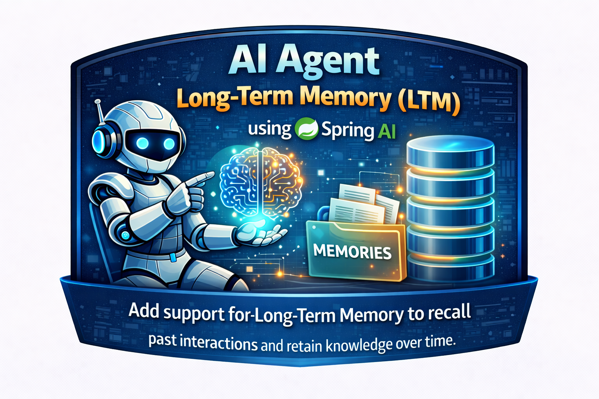
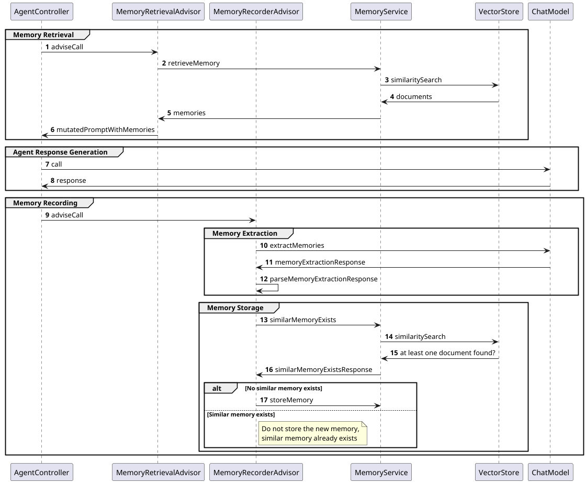

# AI Agent Long-Term Memory (LTM) using Spring AI



## Introduction

In this article I will show how I implemented long-term memory (LTM) in AI agent using Spring AI and MongoDB.

This article builds on the previous articles, [AI Travel Agent using Spring AI](article.md)
and [Persistent and Isolated Chat History using Spring AI](article02_persistent_chat_history.md), if you haven't read
them yet, I recommend getting familiar with them as well.

The full source code for this article can be found on GitHub: https://github.com/dominikcebula/spring-ai-travel-agent

## Why do we need long-term memory (LTM)?

Large Language Models (LLMs) are stateless by default, each prompt is processed independently. This means that for the
agent to understand the context, it needs to be provided with each request to Large Language Models (LLMs).

One of the solutions is to use Chat History (Short-Term Memory). The challenge with this approach is that it does not
scale.

Chat History usually can contain 10–20 last messages. Extending it with more messages will lead to increased cost due to
high tokens consumption and will also cause challenges with hitting the max token limit. This is because Chat History
adds all of those messages to each user prompt, so from the user perspective it looks like only a single message, but
what happens under the hood is that all previous messages are added as well. So what looks like a short message from the
user point of view is actually a user message plus all last 20 messages.

At the same time Agent needs to have access to user preferences and facts from the previous conversations.

The solution is to use Long-Term Memory (LTM) to store important information about the user preferences and provide
facts.

## How does long-term memory work?

Long-Term Memory (LTM) is a storage for information that agent should remember over time about the user.

Compared to Short-Term Memory (STM), it does not contain all messages, instead information is extracted from messages
and stored in a structured way. This allows storing much more selective and targeted information in a more compact form.

Long-Term Memory (LTM) entries are extracted using Large Language Models (LLMs) and stored in a vector database. Each
entry is associated with a vector embedding, which allows for efficient retrieval based on similarity using semantic
search.

Adding Long-Term Memory (LTM) means that Large Language Models (LLMs) will be used not only to answer questions, but
also to extract information from the user's messages. Additionally, an embedding model will be used to create embeddings
for each entry.

When the agent needs to access long-term memory, it can query the vector database using the current context to retrieve
relevant entries. This way, the agent can access important information about the user preferences and facts from
previous conversations without having to include all past messages in the prompt.

When the agent needs to store information in long-term memory, it checks if the vector database already contains an
entry similar to the currently extracted information, and if not, it creates a new entry.

## Prompting for long-term memory extraction

Agent will use LLM to extract information from the user's messages. Below is an example prompt for extracting long-term
memory from a dialog with the user:

```text
USER SAID:
My preference are economy cars when renting a car.

ASSISTANT REPLIED:
Thank you for letting me know! I've noted that you prefer economy cars when renting a car.
I'll keep this preference in mind for any future car rental searches or bookings
to help you find the most suitable options.

YOUR TASK:
Extract up to 5 memories.
```

Here is the system prompt for extracting long-term memory:

```text
Extract long-term memories from a dialog with the user.

A memory is either:

1. EPISODIC: Personal experiences and user-specific preferences
   Examples: "User prefers economy cars", "User prefers budget hotels"

2. SEMANTIC: General domain knowledge and facts
   Examples: "User needs a Schengen visa", "Berlin has comprehensive bike lanes"

Limit extraction to clear, factual information. Do not infer information that was not explicitly stated.
Return an empty array, if no memories can be extracted.

The instance must conform to this JSON schema:
{
  "$schema" : "https://json-schema.org/draft/2020-12/schema",
  "type" : "object",
  "properties" : {
    "memories" : {
      "type" : "array",
      "items" : {
        "type" : "object",
        "properties" : {
          "content" : {
            "type" : "string"
          },
          "memoryType" : {
            "type" : "string",
            "enum" : [ "EPISODIC", "SEMANTIC" ]
          }
        },
        "required" : [ "content", "memoryType" ],
        "additionalProperties" : false
      }
    }
  },
  "required" : [ "memories" ],
  "additionalProperties" : false
}

Do not include code fences, schema, or properties. Output a single-line JSON object.
```

As a result, Long-Term Memory (LTM) entry is extracted by LLM and stored with the vector created by embedding model:

```text
  {
    _id: 'd6440f1a-15d6-4253-a748-f5b68e5013bc',
    content: 'User prefers economy cars when renting a car',
    metadata: {
      createdAt: ISODate('2026-02-17T20:45:18.584Z'),
      memoryType: 'EPISODIC',
      conversationId: '859bdab7-deef-4cef-90a6-3addda92c072'
    },
    embedding: [
            -0.034637451171875,  -0.0021152496337890625,       0.062103271484375,
            0.0277252197265625,        -0.0360107421875, -0.00009626150131225586,
          0.002040863037109375,     -0.0180816650390625,    0.005931854248046875,
          ...
          -0.0011997222900390625,     -0.0261383056640625,        -0.017456054687
    ],
    _class: 'org.springframework.ai.vectorstore.mongodb.atlas.MongoDBAtlasVectorStore$MongoDBDocument'
  }
]
```

## How will AI agent use long-term memory?

Agent will search for relevant long-term memory entries using semantic search before answering questions, if entries are
found, they will be added to the context of the prompt.

Here is the example of a prompt with long-term memories extracted:

```text
Use the Long-term MEMORY below if relevant. Keep answers factual and concise.

----- MEMORY -----
1. Memory Type: EPISODIC, Memory Content: User prefers economy cars when renting a car
2. Memory Type: EPISODIC, Memory Content: User prefers to travel business class whenever available
3. Memory Type: EPISODIC, Memory Content: User prefers to avoid hotel rooms close to the elevator
------------------
```

## Types of long-term memory

I have implemented two types of long-term memory:

EPISODIC: Personal experiences and user-specific preferences
Examples: "User prefers economy cars", "User prefers budget hotels".

SEMANTIC: General domain knowledge and facts
Examples: "User needs a Schengen visa", "Berlin has comprehensive bike lanes".

## How to implement long-term memory in AI agents?

### High-Level Architecture

The below diagram shows operations performed by the agent when processing a user request with added long-term memory
support.

The main additions are Memory Retrieval before answering the user question and Memory Recording after processing the
user request.



### Vector Storage

MongoDB Atlas is used as a vector database that stores embeddings for each long-term memory entry, based on which they
can be retrieved using semantic search.

`application.yml` was changed as follows to configure MongoDB Atlas as a vector database:

```yaml
spring:
  ai:
    vectorstore:
      mongodb:
        initialize-schema: true
        collection-name: ai_vector_store
        index-name: vector_index
        path-name: embedding
        metadata-fields-to-filter: conversationId,memoryType,createdAt
  data:
    mongodb:
      uri: mongodb://localhost:27017/
      database: travel-agent
```

The full source code of the `application.yml` file can be found
under: https://github.com/dominikcebula/spring-ai-travel-agent/blob/main/agent/src/main/resources/application.yml

Additionally `docker-compose.yml` was changed to start MongoDB Atlas when running the application locally:

```yaml
services:
  mongo:
    image: 'mongodb/mongodb-atlas-local:8.0.14'
    restart: always
    ports:
      - "27017:27017"
    environment:
      MONGO_INITDB_DATABASE: travel-agent
      MONGO_INITDB_ROOT_USERNAME: admin
      MONGO_INITDB_ROOT_PASSWORD: secret
```

The full source code of the `docker-compose.yml` file can be found
under: https://github.com/dominikcebula/spring-ai-travel-agent/blob/main/agent/docker-compose.yaml

### Embedding Model

To create vector embeddings for each long-term memory entry `bedrock-cohere` embedding model was used. `application.yml`
was changed in the following way:

```yaml
spring:
  ai:
    model:
      embedding: bedrock-cohere
```

### Recording Memories

Memories are recorded by `MemoryRecorderAdvisor` based on the user's prompt and agent response. LLM is called to extract
long-term memory from the prompt, and then the entry is stored in the vector database.

See the below code snippet showing how `MemoryRecorderAdvisor` was implemented:

```java

@Component
public class MemoryRecorderAdvisor implements CallAdvisor {
  private final MemoryService memoryService;
  private final ChatModel chatModel;

  public MemoryRecorderAdvisor(MemoryService memoryService, ChatModel chatModel) {
    this.memoryService = memoryService;
    this.chatModel = chatModel;
  }

  @Override
  public ChatClientResponse adviseCall(ChatClientRequest chatClientRequest, CallAdvisorChain callAdvisorChain) {
    ChatClientResponse chatClientResponse = callAdvisorChain.nextCall(chatClientRequest);

    extractAndStoreMemories(chatClientRequest, chatClientResponse);

    return chatClientResponse;
  }

  private void extractAndStoreMemories(ChatClientRequest chatClientRequest, ChatClientResponse chatClientResponse) {
    String userPrompt = chatClientRequest.prompt().getUserMessage().getText();
    String chatResponse = getChatResponse(chatClientResponse);

    MemoryExtractionResult memoryExtractionResult = extractMemories(userPrompt, chatResponse);

    memoryExtractionResult = filterOutSimilarMemories(chatClientRequest, memoryExtractionResult);

    storeExtractedMemories(chatClientRequest, memoryExtractionResult);
  }

  @NonNull
  private String getChatResponse(ChatClientResponse chatClientResponse) {
    return Optional.ofNullable(chatClientResponse.chatResponse())
            .map(response -> response.getResults().stream()
                    .map(Generation::getOutput)
                    .map(AssistantMessage::getText)
                    .collect(Collectors.joining()))
            .orElseThrow();
  }

  @NonNull
  private MemoryExtractionResult extractMemories(String userPrompt, String chatResponse) {
    String memoryExtractionUserMessage = getMemoryExtractionUserMessage(userPrompt, chatResponse);
    String memoryExtractionSystemMessage = getMemoryExtractionSystemMessage();

    ChatResponse memoryExtractionResponse = chatModel.call(new Prompt(List.of(
            new UserMessage(memoryExtractionUserMessage),
            new SystemMessage(memoryExtractionSystemMessage)
    )));

    String extractedMemories = memoryExtractionResponse.getResults().stream()
            .map(Generation::getOutput)
            .map(AssistantMessage::getText)
            .collect(Collectors.joining());

    return EXTRACTION_CONVERTER.convert(extractedMemories);
  }

  private MemoryExtractionResult filterOutSimilarMemories(ChatClientRequest chatClientRequest, MemoryExtractionResult memoryExtractionResult) {
    return new MemoryExtractionResult(
            memoryExtractionResult.memories().stream()
                    .filter(memory -> !memoryService.similarMemoryExists(
                            getConversationId(chatClientRequest), memory.content(), memory.memoryType(), SIMILARITY_90_PRC))
                    .toList());
  }

  private void storeExtractedMemories(ChatClientRequest chatClientRequest, MemoryExtractionResult memoryExtractionResult) {
    memoryExtractionResult.memories()
            .forEach(memory -> memoryService.storeMemory(
                    getConversationId(chatClientRequest), memory.content(), memory.memoryType()));
  }

  @NonNull
  private String getMemoryExtractionUserMessage(String userPrompt, String chatResponse) {
    return """
            USER SAID:
            """ +
            userPrompt
            + """
            
            ASSISTANT REPLIED:
            """ +
            chatResponse
            + """
            
            YOUR TASK:
            Extract up to 5 memories.
            """;
  }

  @NonNull
  private String getMemoryExtractionSystemMessage() {
    return """
            Extract long-term memories from a dialog with the user.
            
            A memory is either:
            
            1. EPISODIC: Personal experiences and user-specific preferences
               Examples: "User prefers economy cars", "User prefers budget hotels"
            
            2. SEMANTIC: General domain knowledge and facts
               Examples: "User needs a Schengen visa", "Berlin has comprehensive bike lanes"
            
            Limit extraction to clear, factual information. Do not infer information that was not explicitly stated.
            Return an empty array, if no memories can be extracted.
            
            The instance must conform to this JSON schema:
            """ +
            EXTRACTION_CONVERTER.getJsonSchema()
            + """
            
                Do not include code fences, schema, or properties. Output a single-line JSON object.
            """.trim();
  }

  @Override
  public String getName() {
    return getClass().getSimpleName();
  }

  @Override
  public int getOrder() {
    return HIGHEST_PRECEDENCE + 60;
  }

  private record MemoryCandidate(String content, MemoryType memoryType) {
  }

  private record MemoryExtractionResult(List<MemoryCandidate> memories) {
  }

  private static final BeanOutputConverter<MemoryExtractionResult> EXTRACTION_CONVERTER = new BeanOutputConverter<>(MemoryExtractionResult.class);
}
```

You can also look at the full source code of the `MemoryRecorderAdvisor` class under:
https://github.com/dominikcebula/spring-ai-travel-agent/blob/main/agent/src/main/java/com/dominikcebula/spring/ai/agent/memory/MemoryRecorderAdvisor.java

### Retrieving Memories

Relevant memories are retrieved by `MemoryRetrievalAdvisor` and added to the prompt before calling LLM. This way LLM
will have access to relevant information about the user preferences and facts.

The below code snippet shows how `MemoryRetrievalAdvisor` was implemented:

```java

@Component
public class MemoryRetrievalAdvisor implements CallAdvisor {
  private final MemoryService memoryService;

  public MemoryRetrievalAdvisor(MemoryService memoryService) {
    this.memoryService = memoryService;
  }

  @Override
  public ChatClientResponse adviseCall(ChatClientRequest chatClientRequest, CallAdvisorChain callAdvisorChain) {
    String userPrompt = chatClientRequest.prompt().getUserMessage().getText();

    List<Memory> memories = memoryService.retrieveMemory(
            getConversationId(chatClientRequest),
            userPrompt, MEMORY_LIMIT_5_MEMORIES, SIMILARITY_90_PRC);

    if (!memories.isEmpty()) {
      String memory = """
              Use the Long-term MEMORY below if relevant. Keep answers factual and concise.
              
              ----- MEMORY -----
              """ +
              IntStream.range(0, memories.size())
                      .mapToObj(idx -> String.format("%d. Memory Type: %s, Memory Content: %s",
                              idx + 1, memories.get(idx).memoryType(), memories.get(idx).content()))
                      .reduce("", (a, b) -> a + b + "\n")
              + """
              ------------------
              """;

      chatClientRequest.prompt().augmentSystemMessage(message -> {
        String currentPrompt = message.getText();

        String promptWithMemory = new StringBuilder()
                .append(currentPrompt)
                .append("\n\n")
                .append(memory)
                .toString();

        return message.mutate()
                .text(promptWithMemory)
                .build();
      });
    }

    return callAdvisorChain.nextCall(chatClientRequest);
  }

  @Override
  public String getName() {
    return getClass().getSimpleName();
  }

  @Override
  public int getOrder() {
    return HIGHEST_PRECEDENCE + 40;
  }
}
```

The full source code of the `MemoryRetrievalAdvisor` class can be found
under: https://github.com/dominikcebula/spring-ai-travel-agent/blob/main/agent/src/main/java/com/dominikcebula/spring/ai/agent/memory/MemoryRetrievalAdvisor.java

### Agent System Prompt

System prompt for the agent was updated to include instructions on how to use long-term memory:

```java

@RestController
@RequestMapping("/api/v1")
public class AgentController {
  private final ChatClient chatClient;

  public AgentController(ChatClient.Builder chatClientBuilder, ToolCallbackProvider toolCallbackProvider, ChatMemory chatMemory, MemoryRecorderAdvisor memoryRecorderAdvisor, MemoryRetrievalAdvisor memoryRetrievalAdvisor) {
    this.chatClient = chatClientBuilder
            .defaultToolCallbacks(toolCallbackProvider)
            .defaultAdvisors(
                    MessageChatMemoryAdvisor.builder(chatMemory).build(),
                    memoryRecorderAdvisor,
                    memoryRetrievalAdvisor
            )
            .defaultSystem(
                    """
                            You are a helpful travel assistant who can help with booking flights, hotels, and rental cars.
                            Your primary responsibility is to help users search for, compare, and book flights, hotels, and rental cars efficiently and accurately.
                            
                            Use provided Flight Booking Tools, Hotels Booking Tools, and Cars Rental Tools to assist the user with their travel needs.
                            Always use the tools available to get information and perform actions on behalf of the user.
                            
                            Be professional, concise, and friendly.
                            Use clear, structured responses that are easy to scan.
                            Avoid unnecessary verbosity while ensuring all critical booking information is communicated.
                            Your goal is to act as a reliable, tool-driven travel booking assistant that helps users complete their travel arrangements with confidence and clarity.
                            
                            You have access to the following types of memory:
                            1. Short-term memory: Chat history, the current conversation thread
                            2. Long-term memory:
                               A. EPISODIC: Personal experiences and user-specific preferences
                                  Examples: "User prefers economy cars", "User prefers budget hotels"
                               B. SEMANTIC: General domain knowledge and facts
                                  Examples: "User needs a Schengen visa", "Berlin has comprehensive bike lanes"
                            
                            If the user asks for information that is not related to travel bookings, respond politely that you can only assist with travel bookings.
                            """)
            .build();
  }

  @GetMapping("/agent")
  public String generation(@RequestParam String userInput, @RequestParam UUID conversationId) {
    return chatClient.prompt()
            .user(userInput)
            .advisors(advisorSpec -> advisorSpec.param(CONVERSATION_ID, conversationId))
            .call()
            .content();
  }
}
```

The full source code of the `AgentController` class can be found
under: https://github.com/dominikcebula/spring-ai-travel-agent/blob/main/agent/src/main/java/com/dominikcebula/spring/ai/agent/AgentController.java

### Memory Service

Memory storage, retrieval, and similarity search were implemented under `MemoryService`.

The below code snippet shows how `MemoryService` was implemented:

```java

@Service
public class MemoryService {
  private static final String META_CONVERSATION_ID = "conversationId";
  private static final String META_MEMORY_TYPE = "memoryType";
  private static final String META_CREATED_AT = "createdAt";

  private final VectorStore vectorStore;

  public MemoryService(VectorStore vectorStore) {
    this.vectorStore = vectorStore;
  }

  public void storeMemory(UUID conversationId, String content, MemoryType memoryType) {
    Memory memory = new Memory(UUID.randomUUID(), conversationId, content, memoryType, LocalDateTime.now());

    Document document = new Document(
            memory.id().toString(),
            memory.content(),
            Map.of(
                    META_CONVERSATION_ID, memory.conversationId().toString(),
                    META_MEMORY_TYPE, memory.memoryType(),
                    META_CREATED_AT, memory.createdAt()
            )
    );

    vectorStore.add(singletonList(document));
  }

  public boolean similarMemoryExists(UUID conversationId, String content, MemoryType memoryType, float distanceThreshold) {
    FilterExpressionBuilder filterExpressionBuilder = new FilterExpressionBuilder();

    Filter.Expression filterExpression = filterExpressionBuilder.and(
            filterExpressionBuilder.eq(META_CONVERSATION_ID, conversationId.toString()),
            filterExpressionBuilder.eq(META_MEMORY_TYPE, memoryType.name())
    ).build();

    List<Document> foundMemories = vectorStore.similaritySearch(
            SearchRequest.builder()
                    .query(content)
                    .topK(1)
                    .filterExpression(filterExpression)
                    .similarityThreshold(distanceThreshold)
                    .build());

    return !foundMemories.isEmpty();
  }

  public List<Memory> retrieveMemory(UUID conversationId, String userPrompt, int limit, float distanceThreshold) {
    FilterExpressionBuilder filterExpressionBuilder = new FilterExpressionBuilder();

    Filter.Expression filterExpression = filterExpressionBuilder.eq(META_CONVERSATION_ID, conversationId.toString()).build();

    List<Document> documents = vectorStore.similaritySearch(
            SearchRequest.builder()
                    .query(userPrompt)
                    .topK(limit)
                    .filterExpression(filterExpression)
                    .similarityThreshold(distanceThreshold)
                    .build());

    return documents.stream()
            .map(this::mapToMemory)
            .toList();
  }

  private Memory mapToMemory(Document document) {
    return new Memory(
            UUID.fromString(document.getId()),
            UUID.fromString(document.getMetadata().get(META_CONVERSATION_ID).toString()),
            document.getText(),
            MemoryType.valueOf(document.getMetadata().get(META_MEMORY_TYPE).toString()),
            DateUtils.toLocalDateTime((Date) document.getMetadata().get(META_CREATED_AT))
    );
  }
}
```

The full source code of the `MemoryService` class can be found
under: https://github.com/dominikcebula/spring-ai-travel-agent/blob/main/agent/src/main/java/com/dominikcebula/spring/ai/agent/memory/MemoryService.java

## Summary

TBD

## References

- De Lio, R. (2025, July 16). Agent Long-term Memory with Spring AI & Redis. Retrieved February 16, 2026,
  from https://medium.com/redis-with-raphael-de-lio/agent-memory-with-spring-ai-redis-af26dc7368bd
- [Source Code on GitHub](https://github.com/dominikcebula/spring-ai-travel-agent/)
- [Spring AI Documentation](https://docs.spring.io/spring-ai/reference/)
